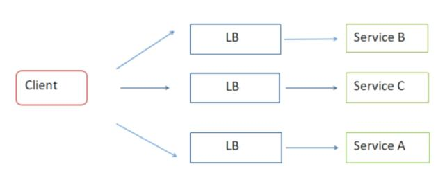
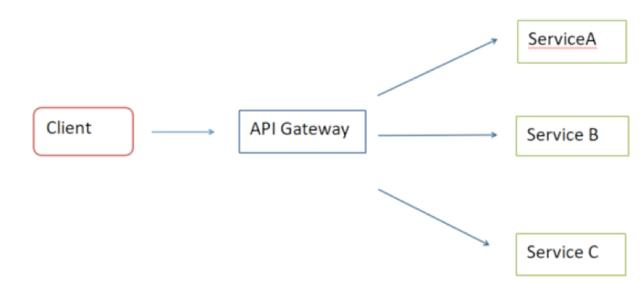
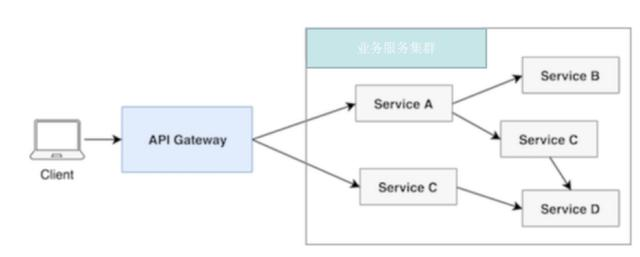
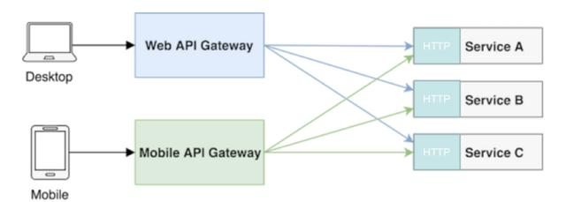
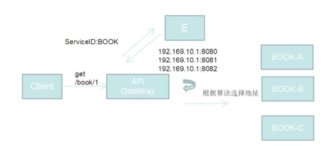
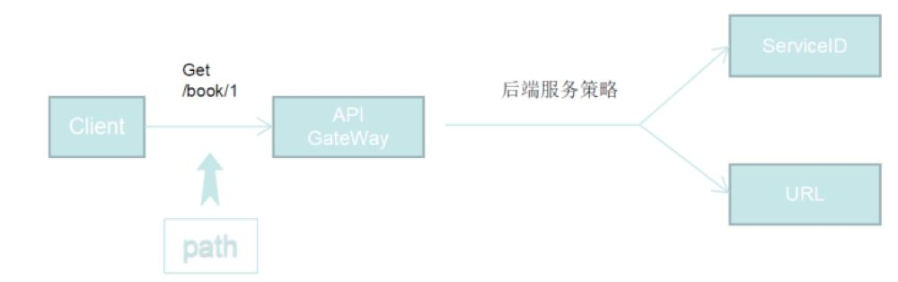
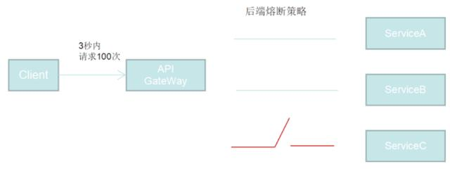
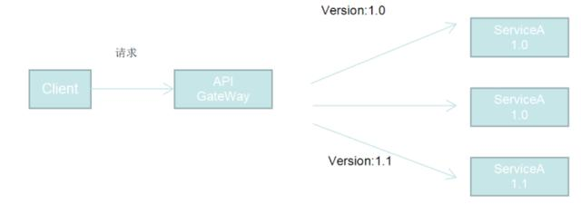
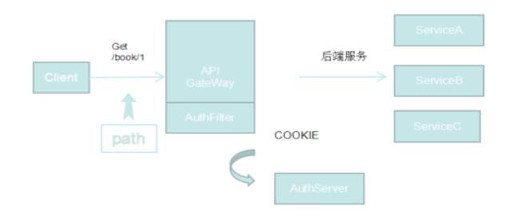
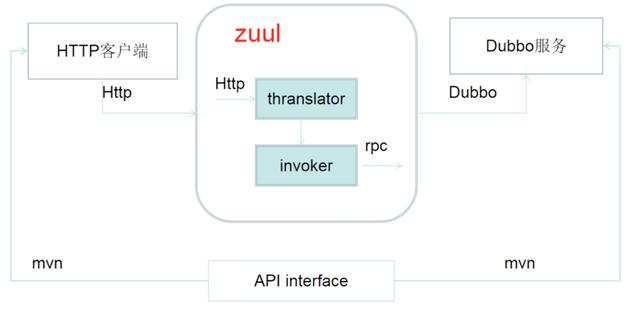

## API网关构建微服务


##### 1.1 什么是API网关

API Gateway 是微服务架构体系中的一类型特殊服务，它是所有微服务的入口，它的职责是执行路由请求、协议转换、聚合数据、认证、限流、熔断等公共基础服务



从部署结构上说，上图是不采用API Gateway的微服务部署模式，我们可以清晰看到，
这种部署模式下，客户端与负载均衡器（一般是Nginx）直接交互，完成服务的调用。但这是这种模式下，也有它的不足。

```
不支持动态扩展，系统每多一个服务，就需要部署或修改负载均衡器。
无法做到动态的开关服务，若要下线某个服务，需要运维人员将服务地址从负载均衡器中移除。
对于API的限流，安全等控制，需要每个微服务去自己实现，增加了微服务的复杂性，同时也违反了微服务设计的单一职责原则。

```

Chris Richardson在http://microservices.io/中也提及到，在微服务的架构模式下，API Gateway是微服务架构中一个非常通用的模式，
利用API Gateway可以解决调用方如何调用独立的微服务这个问题。



上图为采用API Gateway模式，我们通过上图可以看到，API Gateway做为系统统一入口，实现了对各个微服务间的整合，同时又做到了对客户端友好，
屏蔽系统了复杂性和差异性。对比之前无API Gateway模式，API Gateway具有几个比较重要的优点：

```
采用API Gateway可以与微服务注册中心连接，实现微服务无感知动态扩容。
API Gateway对于无法访问的服务，可以做到自动熔断，无需人工参与。
API Gateway可以方便的实现蓝绿部署，金丝雀发布或A/B发布。
API Gateway做为系统统一入口，我们可以将各个微服务公共功能放在API Gateway中实现以尽可能减少各服务的职责。
帮助我们实现客户端的负载均衡策略。

```

##### 1.1 API的网关分类

Chris Richardson 在他的博客中把 API 网关划分为以下两种：

```
单节点 API 网关
Backends for frontends 网关（BFF模式）
  
```

单节点网关：单节点的 API网关为每个客户端提供不同的API，而不是提供一种万能风格的API。



Backends for frontends 网关：这种模式是针对不同的客户端来实现一个不同的API网关。




##### 1.3 API Gateway中的主要功能


Gateway 职责之1 ：负载均衡



API Gateway可以帮助我们轻松的实现负载均衡，利用服务发现知道所有Service的地址和位置，通过在API Gateway中实现负载均衡算法，
ZUUL默认使用RR算法实现负载均衡效果。


Gateway 职责之2 ：接口路由



需要根据各种条件将请求路由到正确的目的地。在实现上采用了路由服务，Gateway定期从路由服务获取路由表，达到了解耦、实时更新的效果；
经过通用逻辑预处理后，无线接口请求将进一步分发给后端处理。URL或者ServiceID在配置文件或者系统里做映射，分发逻辑根据请求中的URL信息，
找到对应的业务后端ServiceID或者URL，然后把请求交给业务后端做相应处理。


Gateway 职责之3： 服务熔断



在实际生产中，一些服务很有可能因为某些原因发生故障，如果此时不采取一些手段，会导致整个系统“雪崩”。
或因系统整体负载的考虑，会对服务访问次数进行限制。
服务熔断、服务降级就是解决上述问题的主要方式。API Gateway可以帮助我们实现这些功能，对于服务的调用次数的限制，当某服务达到上限时，
API Gateway会自动停止向上游服务发送请求，并像客户端返回错误提示信息或一个统一的响应，进行服务降级。
对于需要临时发生故障的服务，API Gateway自动可以打开对应服务的断路器，进行服务熔断，防止整个系统“雪崩”。


Gateway 职责之4 ： 灰度发布



服务发布上线过程中，我们不可能将新版本全部部署在生产环节中，因为新版本并没有接受真实用户、真实数据、真实环境的考验，此时我们需要进行灰度发布，
灰度发布可以保证整体系统的稳定，在初始灰度的时候就可以发现、调整问题，同时影响小。API Gateway可以帮助我们轻松的完成灰度发布，
只需要在API Gateway中配置我们需要的规则，按版本，API Gateway会自动为我们完成实际的请求分流。


Gateway 职责之5： 权限认证



不同的服务之间常常有一些共有的逻辑需要处理，比如权限认证，由于 Gateway 恰巧在各个微服务的前端，
可以在 Gateway 实现权限的认证，比如可以在 Gateway 层实现 cookie 或 token 的认证。


Gateway 职责之6：限流

对于任何一类请求，都设置了容量上限，并不能无限制处理。
Gateway可以为每类请求设置并发上限，当到达上限时，Gateway将不在转发请求，而是直接返回，保护后端服务。
如果在后端服务过载的情况下，仍然转发请求，只会恶化问题。


Gateway 职责之7： 服务演进

借助 Gateway 你可以很方便的在 Gateway 之后部署不同的服务，也就是可以同时存在两种不同的服务，这样可以帮助单体应用向微服务渐进式的演化.


Gateway 职责之8: 数据聚合

由于不同的客户端往往需要的数据完全不同，而这些数据又是不同的 service 提供的，借助 Gateway 我们可以方便完成来自不同 service 的数据聚合，
以达到根据不同 client 进行数据定制的目的


Gateway 职责之9: 协议转换



鉴于不同的团队采用的数据协议可能完全不同，Gateway 可以根据场景需要对不同的微服务之间进行协议转换，上图是HTTP协议与Dubbo协议转换的架构图实现。


Gateway 职责之10：监控报警

Gateway可以对接运维报警工具。当出现问题时，会及时报警，尽早发现问题，减少损失。


##### 2.API网关技术选型

主流API网关技术栈比较：


主流API网关技术说明：

目前比较成熟以及用的比较广泛的网关有以下几种：

```
Kong/kong：基于 OpenResty 那一套做的，依赖于 Nginx 强悍的性能，添加了动态服务管理功能，以及插件机制，语言是 lua.

Tyk：Tyk是一个开放源码的API网关，它是快速、可扩展和现代的。Tyk提供了一个API管理平台，其中包括API网关、API分析、开发人员门户和API管理面板。
Try 是一个基于Go实现的网关服务。

apiaxle: Nodejs 实现的一个 API 网关,适合非阻塞IO处理

Netflix zuul：Zuul是一种提供动态路由、监视、弹性、安全性等功能的边缘服务。Zuul是Netflix出品的一个基于JVM路由和服务端的负载均衡器。

SpringCloud gateway：SpringCloud社区推出的一个网关解决方案，成熟度上相比ZUUL来说还是差很多，没有经过像ZUUL在Netflix的商用验证。

```

选型考虑：

业务场景支持：

```
ZUUL作为一个网关平台集，支持标准的Filter机制更容易和业务系统做集成，作为路由和过滤的公共功能机制更容易支持业务场景，
更容易实现业务逻辑在网关平台的落地。

```

技术成熟度及生态：

```
ZUUL1,X基于Nefilx微服体系，本身经过Netflix商用，相对成熟，在加入SpringCloud微服务体系后如虎添翼，
得到了SpringCloud/SpringBoot周边基础设施及生态体系在开发及运行时的大力支持。并且诸多互联网公司采用ZUUL做API- 网关二次开发， 
例如：携程，阿里巴巴等互联网公司

```

成本效率：

```
ZUUL1在编程模型上基于消息线程1V1映射模型，相对控制逻辑比较简单，在二次开发成本及与业务集成成本都是非常低的。

```

性能：

```
在单机多核情况下ZUUL原始性能非常接近Nginx. 并且可以通过ZUUL集群水平扩展网关性能。

```

综上我们采用了ZUUL作为我们的二次开发平台。


##### 3.API网关架构与设计

3.1 物理架构部署图：

网关的调用方主要包括浏览器，应用服务，App应用，以及三方开发者和其他业务调用方。通过LVS做负载均衡，网关应用调用到实际的业务集群。


3.2 网关逻辑架构图：

API网关基于ZUUL-Core及SpringCloud体系架构，对Zuul-Core中的FilterLoader及基于ZUUL中的Locator机制都做了相应的二次开发，
支持相应的特性功能。下图是API-GateWay的整体架构图。


3.3 网关业务模块图：

网关生态基于统一开发框架，内部主要包含控制台、网关核心、网关统计与监控三大模块：

```
控制台主要对API生命周期进行管理，以及ACL、流量管控等功能；
网关核心主要处理API调用，包含鉴权、限流、路由、第三方Filter动态加载等功能；
统计与监控模块主要完成API调用的统计和监控报警

```

统计与监控模块主要完成API调用的统计和监控报警


3.5 网关核心设计

动态路由：实现路由表的动态创建，动态加载，动态发布，下线等服务。


动态Filter：改变了ZUUL默认基于Groovy的Filter加载机制，采用基于JAVA-jar包的动态Filter加载，对业务逻辑集成到网关平台更加方便友好，
业务同事只需要关注业务逻辑，屏蔽了网关底层的技术实现细节


灵活的路由绑定： 实现可视化的路由ID与服务组件的动态绑定功能


二级缓存：网关高性能特性要求，需要一个高性能的本地缓存负责一些配置关键信息：例如；路由表；黑白名单等等。


蓝绿部署：在服务不停机的情况下， 实现根据版本信息的流量切换，增加系统的SLA水平。目前可以实现基于相同服务名下，
不同版本服务注册在同一个Eureka注册中心的新旧版本服务切换。


控制台：控制台功能是API网关的一个主要功能， 开发人员只需要通过控制台就可以自助的完成路由的创建，公共组件的路由绑定等服务。


数据统计，预警，日志：这些是网关OLAP方面的服务，通过网关可以增强对业务系统的监控预警和辅助管理等功能


此外，我们还会对ZUUL自带的线程池隔离机制；链式处理机制做进一步的深度开发整合，以及后续我们陆续会开发和SLA相关的一些功能包括熔断降级；
限流保护等等功能


## 总结

API Gateway在微服务架构中起到了至关重要的作用。

在文章中我们介绍了什么是API Gateway以及为什么需要API Gateway。API Gateway它作为微服务系统的大门，向我们提供了请求转发，服务熔断，
限流流控等公共功能，它又统一整合了各个微服务，对外屏蔽了系统的复杂性和差异性。

介绍了我们在网关技术选型主要基于什么考虑做技术选型方面的工作，以及API网关系统的架构设计，及主要功能模块等内容。

随后我们会给业务系统开发同事提供接入网关平台的第三方组件开发规范；以及后续在测试环境，生产环境部署发布服务流程及使用文档说明，
使网关平台逐渐工具化，帮助业务系统更好实践微服务及提升整体SLA水准。


