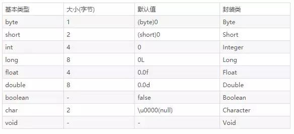
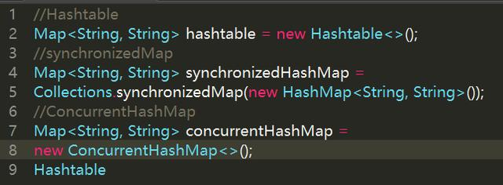
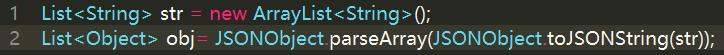

## Java基础面试题及详细答案整理汇总


##### 1.Java的基本数据类型几个，都是什么以及大小，以及他们的封装类有哪些？

8种基本数据类型：byte 、short 、int、long 、float、double、boolean、char。

封装类型对应为：Byte、Short、Integer、Long、Float、Double、Boolean、Character。




##### 2.什么是引用数据类型？

引用数据类型，是由类的编译器定义的，用于访问对象。这些变量被定义为不可更改的特定类型。

当一个变量值为引用类型的时候，直接赋值其他变量传递的是引用。

同样的，引用的数据在某个地方改变了值会影响所有调用这个变量的地方。

例如：Employee， Puppy 等等

类对象和数组变量就是这种引用数据类型。

任何引用数据类型的默认值都为null。

一个引用数据类型可以被用于任何声明类型和兼容类型的对象。


##### 3.条件语句中switch句柄，能否用string做为参数？

在jdk1.7之前，switch 只能支持 byte、short、char、int 这几个基本数据类型和其对应的封装类型。

switch后面的括号里面只能放int类型的值，但由于byte，short，char类型，它们会自动转换为int类型（精度小的向大的转化），所以这些现在都支持了。

jdk1.7后，整型（int），枚举类，字符串(string)都可以支持

（**本质上是，jdk1.7并没有新的指令来处理switch string，而是通过调用switch中string.hashCode,将string转换为int从而进行判断**）


##### 4.equals与==的区别是什么

使用==比较基本数据类型如：boolean、int、char等等，equals()用来比较对象是否为同一个。

1、==是判断两个变量或实例是不是指向同一个内存空间；

equals是判断两个变量或实例所指向的内存空间的值是不是相同。

2、==是指对内存地址进行比较；equals()是对字符串的内容进行比较。

3、==指引用是否相同； equals()指的是值是否相同


##### 5.自动拆箱和自动装箱定义

>自动装箱是将一个java定义的基本数据类型赋值给相应封装类的变量。

拆箱与装箱是相反的操作，自动拆箱则是将一个封装类的变量赋值给相应基本数据类型的变量。


	Integer i = new Integer(100);
	
	int num1 = 100;//普通变量
	
	Integer num4 = 100; //自动装箱
	
	Integer num2 = num1;//自动装箱
	
	int num3 = num2; //自动拆箱


##### 6.Object都有什么公用的方法？


Object是所有类的父类，任何类都默认继承Object

> clone方法，实现对象的浅复制，当实现了Cloneable接口才可以调用该方法，否则会抛出异常，类型为CloneNotSupportedException。

> equals在Object中与==是一样的，子类一般需要重写该方法。

> hashCode该方法用于哈希查找，重写了equals方法一般都要重写hashCode方法。这个方法在一些具有哈希功能的Collection中用到。

> getClassfinal方法，获得运行时类型

> wait使当前线程等待该对象的锁，当前线程必须是该对象的拥有者，也就是具有该对象的锁。
wait() 方法一直等待，直到获得锁或者被中断。
wait(long timeout) 设定一个超时间隔，如果在规定时间内没有获得锁就返回。

	调用该方法后当前线程进入睡眠状态，直到以下事件发生
	
	1、其他线程调用了该对象的notify方法。
	
	2、其他线程调用了该对象的notifyAll方法。
	
	3、其他线程调用了interrupt中断该线程。
	
	4、时间间隔到了。
	
	5、此时该线程就可以被调度了，如果是被中断的话就抛出一个InterruptedException异常。

> notify唤醒在该对象上等待的某个线程。

> notifyAll唤醒在该对象上等待的所有线程。

> toString转换成字符串，一般子类都有重写，否则打印句柄。


##### 7.Java的四种级别的引用都有什么？以及对应的引用场景在哪里？

从JDK1.2版本开始，把对象的引用分为四种级别，从而使程序能更加灵活的控制对象的生命周期。这四种级别由高到低依次为：强引用、软引用、弱引用和虚引用。

> 1、强引用

最普遍的一种引用方式，如String s = "abc"，变量s就是字符串“abc”的强引用，只要强引用存在，则垃圾回收器就不会回收这个对象。

> 2、软引用（SoftReference）

用于描述还有用但非必须的对象，如果内存足够，不回收，如果内存不足，则回收。一般用于实现内存敏感的高速缓存，软引用可以和引用队列ReferenceQueue联合使用，如果软引用的对象被垃圾回收，JVM就会把这个软引用加入到与之关联的引用队列中。

> 3、弱引用（WeakReference）

弱引用和软引用大致相同，弱引用与软引用的区别在于：只具有弱引用的对象拥有更短暂的生命周期。在垃圾回收器线程扫描它所管辖的内存区域的过程中，一旦发现了只具有弱引用的对象，不管当前内存空间足够与否，都会回收它的内存。

> 4、虚引用（PhantomReference）

就是形同虚设，与其他几种引用都不同，虚引用并不会决定对象的生命周期。如果一个对象仅持有虚引用，那么它就和没有任何引用一样，在任何时候都可能被垃圾回收器回收。 虚引用主要用来跟踪对象被垃圾回收器回收的活动。

**虚引用与软引用和弱引用的一个区别在于：**

虚引用必须和引用队列 （ReferenceQueue）联合使用。当垃圾回收器准备回收一个对象时，如果发现它还有虚引，就会在回收对象的内存之前，把这个虚引用加入到与之关联的引用队列中。


##### 8.Java中Hashcode的作用是什么？

> 1、HashCode的特性

（1）HashCode的存在主要是用于查找的快捷性，如Hashtable，HashMap等，HashCode经常用于确定对象的存储地址。

（2）如果两个对象相同，equals方法一定返回true，并且这两个对象的HashCode一定相同。

（3）两个对象的HashCode相同，并不一定表示两个对象就相同，即equals()不一定为true，只能够说明这两个对象在一个散列存储结构中。

（4）如果对象的equals方法被重写，那么对象的HashCode也应该重写。

> 2、HashCode作用

Java中的集合有两类，一类是List，再有一类是Set。前者集合内的元素是有序的，元素可以重复；后者元素无序，但元素不可重复。

equals方法可用于保证元素不重复，但如果每增加一个元素就检查一次，若集合中现在已经有1000个元素，那么第1001个元素加入集合时，就要调用1000次equals方法。这显然会大大降低效率。?于是，Java采用了哈希表的原理。

哈希算法也称为散列算法，是将数据依特定算法直接指定到一个地址上。

这样一来，当集合要添加新的元素时，先调用这个元素的HashCode方法，就一下子能定位到它应该放置的物理位置上。

（1）如果这个位置上没有元素，它就可以直接存储在这个位置上，不用再进行任何比较了。

（2）如果这个位置上已经有元素了，就调用它的equals方法与新元素进行比较，相同的话就不存了。

（3）不相同的话，也就是发生了Hash key相同导致冲突的情况，那么就在这个Hash key的地方产生一个链表，将所有产生相同HashCode的对象放到这个单链表上去，串在一起（很少出现）。

这样一来实际调用equals方法的次数就大大降低了，几乎只需要一两次。

如何理解HashCode的作用：

从Object角度看，JVM每new一个Object，它都会将这个Object丢到一个Hash表中去，这样的话，下次做Object的比较或者取这个对象的时候（读取过程），它会根据对象的HashCode再从Hash表中取这个对象。这样做的目的是提高取对象的效率。若HashCode相同再去调用equal。

> 3、HashCode实践（如何用来查找）

HashCode是用于查找使用的，而equals是用于比较两个对象是否相等的。

（1）例如内存中有这样的位置

0 1 2 3 4 5 6 7

而我有个类，这个类有个字段叫ID，我要把这个类存放在以上8个位置之一，如果不用HashCode而任意存放，那么当查找时就需要到这八个位置里挨个去找，或者用二分法一类的算法。

但以上问题如果用HashCode就会使效率提高很多定义我们的HashCode为ID％8，比如我们的ID为9，9除8的余数为1，那么我们就把该类存在1这个位置，如果ID是13，求得的余数是5，那么我们就把该类放在5这个位置。依此类推。

（2）但是如果两个类有相同的HashCode，例如9除以8和17除以8的余数都是1，也就是说，我们先通过?HashCode来判断两个类是否存放某个桶里，但这个桶里可能有很多类，那么我们就需要再通过equals在这个桶里找到我们要的类。


##### 9.HashMap的hashcode的作用

hashCode的存在主要是用于查找的快捷性，如Hashtable，HashMap等，hashCode是用来在散列存储结构中确定对象的存储地址的。

如果两个对象相同，就是适用于equals(java.lang.Object) 方法，那么这两个对象的hashCode一定要相同。

如果对象的equals方法被重写，那么对象的hashCode也尽量重写，并且产生hashCode使用的对象，一定要和equals方法中使用的一致，否则就会违反上面提到的第2点。

两个对象的hashCode相同，并不一定表示两个对象就相同，也就是不一定适用于equals(java.lang.Object) 方法，只能够说明这两个对象在散列存储结构中，如Hashtable，他们“存放在同一个篮子里”。

什么时候需要重写？

一般的地方不需要重载hashCode，只有当类需要放在HashTable、HashMap、HashSet等等hash结构的集合时才会重载hashCode，那么为什么要重载hashCode呢？

要比较两个类的内容属性值，是否相同时候，根据hashCode 重写规则，重写类的 指定字段的hashCode()，equals()方法。

> 为什么要重载equal方法？

因为Object的equal方法默认是两个对象的引用的比较，意思就是指向同一内存,地址相同则相等，否则不相等；如果你现在需要利用对象里面的值来判断是否相等，则重载equal方法。


##### 10.为什么重载hashCode方法？

一般的地方不需要重载hashCode，只有当类需要放在HashTable、HashMap、HashSet等等hash结构的集合时才会重载hashCode，那么为什么要重载hashCode呢？

如果你重写了equals，比如说是基于对象的内容实现的，而保留hashCode的实现不变，那么很可能某两个对象明明是“相等”，而hashCode却不一样。

这样，当你用其中的一个作为键保存到hashMap、hasoTable或hashSet中，再以“相等的”找另一个作为键值去查找他们的时候，则根本找不到。


> 为什么equals()相等，hashCode就一定要相等，而hashCode相等，却不要求equals相等?

1、因为是按照hashCode来访问小内存块，所以hashCode必须相等。

2、HashMap获取一个对象是比较key的hashCode相等和equal为true。

之所以hashCode相等，却可以equal不等，就比如ObjectA和ObjectB他们都有属性name，那么hashCode都以name计算，所以hashCode一样，但是两个对象属于不同类型，所以equal为false。

> 为什么需要hashCode?

1、通过hashCode可以很快的查到小内存块。

2、通过hashCode比较比equal方法快，当get时先比较hashCode，如果hashCode不同，直接返回false。


##### 11.ArrayList、LinkedList、Vector的区别

1.List的三个子类的特点

> ArrayList:
	
	底层数据结构是数组，查询快，增删慢。
	
	线程不安全，效率高。
	
> Vector:

	底层数据结构是数组，查询快，增删慢。
	
	线程安全，效率低。
	
	Vector相对ArrayList查询慢(线程安全的)。
	
	Vector相对LinkedList增删慢(数组结构)。

> LinkedList

	底层数据结构是链表，查询慢，增删快。
	
	线程不安全，效率高。

2.Vector和ArrayList的区别

	Vector是线程安全的,效率低。
	
	ArrayList是线程不安全的,效率高。
	
	共同点:底层数据结构都是数组实现的,查询快,增删慢。

3.ArrayList和LinkedList的区别

	ArrayList底层是数组结果,查询和修改快。
	
	LinkedList底层是链表结构的,增和删比较快,查询和修改比较慢。
	
	共同点:都是线程不安全的

4.List有三个子类使用
	
	查询多用ArrayList。
	
	增删多用LinkedList。
	
	如果都多ArrayList。


##### 12.String、StringBuilder与StringBuffer的区别

String：适用于少量的字符串操作的情况。

StringBuilder：适用于单线程下在字符缓冲区进行大量操作的情况，线程不安全的。

StringBuffer：适用多线程下在字符缓冲区进行大量操作的情况。线程安全的。

**区别**

主要是在两个方面，即运行速度和线程安全这两方面。首先说运行速度，或者说是执行速度，在这方面运行速度快慢为：StringBuilder > StringBuffer > String。

> String最慢的原因

String为字符串常量，而StringBuilder和StringBuffer均为字符串变量，即String对象一旦创建之后该对象是不可更改的，但后两者的对象是变量，是可以更改的。

> 线程安全

在线程安全上，StringBuilder是线程不安全的，而StringBuffer是线程安全的。

如果一个StringBuffer对象在字符串缓冲区被多个线程使用时，StringBuffer中很多方法可以带有synchronized(同步)关键字，所以可以保证线程是安全的，但StringBuilder的方法则没有该关键字，所以不能保证线程安全，有可能会出现一些错误的操作。所以如果要进行的操作是多线程的，那么就要使用StringBuffer，但是在单线程的情况下，还是建议使用速度比较快的StringBuilder。

> synchronized 关键字，代表这个方法加锁,相当于不管哪一个线程（例如线程A），运行到这个方法时,都要检查有没有其它线程B（或者C、 D等）正在用这个方法(或者该类的其他同步方或者该类的其他同步方法)，有的话要等正在使用synchronized方法的线程B（或者C 、D）运行完这个方法后再运行此线程A,没有的话,锁定调用者,然后直接运行


##### 13.Map、Set、List、Queue、Stack的特点与用法

> Collection 是对象集合， Collection 有两个子接口 List 和 Set

List 可以通过下标 (1,2..) 来取得值，值可以重复。Set 只能通过游标来取值，并且值是不能重复的。

ArrayList ， Vector ， LinkedList 是 List 的实现类

ArrayList 是线程不安全的， Vector 是线程安全的，这两个类底层都是由数组实现的。

LinkedList 是线程不安全的，底层是由链表实现的。

Set 不包含重复元素的集合，set中最多包含一个null元素,只能用Lterator实现单项遍历，Set中没有同步方法。

> Map 是键值对集合

HashTable 和 HashMap 是 Map 的实现类。

HashTable 是线程安全的，不能存储 null 值。

HashMap 不是线程安全的，可以存储 null 值。

> Stack类：继承自Vector，实现一个后进先出的栈。提供了几个基本方法，push、pop、peak、empty、search等。

> Queue接口：提供了几个基本方法，offer、poll、peek等。已知实现类有LinkedList、PriorityQueue等。


##### 14.HashMap和HashTable的区别


Hashtable是基于陈旧的Dictionary类的，HashMap是Java 1.2引进的Map接口的一个实现，它们都是集合中将数据无序存放的。

> 1、hashMap去掉了HashTable的contains方法，但是加上了containsValue()和containsKey()方法

HashTable Synchronize同步的，线程安全

HashMap 非Synchronize线程同步的，线程不安全

> 2、Hashtable不允许 null 值(key 和 value 都不可以),效率低; HashMap允许 null 值(key和value都可以),效率高

> 3、两者的遍历方式大同小异，Hashtable仅仅比HashMap多一个elements方法

> 4、HashTable使用Enumeration，HashMap使用Iterator


从内部机制实现上的区别如下：

1.哈希值的使用不同，Hashtable直接使用对象的hashCode

而HashMap重新计算hash值，而且用与代替求模：

2.Hashtable中hash数组默认大小是11，增加的方式是 old*2+1。HashMap中hash数组的默认大小是16，而且一定是2的指数


##### 15.JDK7与JDK8中HashMap的实现

> JDK7中的HashMap

HashMap底层维护一个数组，数组中的每一项都是一个Entry。

	transient Entry<K,V>[] table;

我们向 HashMap 中所放置的对象实际上是存储在该数组当中。 而Map中的key，value则以Entry的形式存放在数组中。


总结一下map.put后的过程：

当向 HashMap 中 put 一对键值时，它会根据 key的 hashCode 值计算出一个位置， 该位置就是此对象准备往数组中存放的位置。

如果该位置没有对象存在，就将此对象直接放进数组当中；如果该位置已经有对象存在了，则顺着此存在的对象的链开始寻找(为了判断是否是否值相同，map不允许<key,value>键值对重复)， 如果此链上有对象的话，再去使用 equals方法进行比较，如果对此链上的每个对象的 equals 方法比较都为 false，则将该对象放到数组当中，然后将数组中该位置以前存在的那个对象链接到此对象的后面


> JDK8中的HashMap

JDK8中采用的是位桶+链表/红黑树（有关红黑树请查看红黑树）的方式，也是非线程安全的。当某个位桶的链表的长度达到某个阀值的时候，这个链表就将转换成红黑树。

JDK8中，当同一个hash值的节点数不小于8时，将不再以单链表的形式存储了，会被调整成一颗红黑树（上图中null节点没画）。这就是JDK7与JDK8中HashMap实现的最大区别。

接下来，我们来看下JDK8中HashMap的源码实现。

JDK中Entry的名字变成了Node，原因是和红黑树的实现TreeNode相关联。

	transient Node<K,V>[] table;

当冲突节点数不小于8-1时，转换成红黑树。

	staticfinalint TREEIFY_THRESHOLD = 8;


##### 16.HashMap和ConcurrentHashMap的区别，HashMap的底层源码

为了线程安全从ConcurrentHashMap代码中可以看出，它引入了一个“分段锁”的概念，具体可以理解为把一个大的Map拆分成N个小的HashTable，根据key.hashCode()来决定把key放到哪个HashTable中。

Hashmap本质是数组加链表。根据key取得hash值，然后计算出数组下标，如果多个key对应到同一个下标，就用链表串起来，新插入的在前面。

ConcurrentHashMap：在hashMap的基础上，ConcurrentHashMap将数据分为多个segment，默认16个（concurrency level），然后每次操作对一个segment加锁，避免多线程锁的几率，提高并发效率。

总结

JDK6,7中的ConcurrentHashmap主要使用Segment来实现减小锁粒度，把HashMap分割成若干个Segment，在put的时候需要锁住Segment，get时候不加锁，使用volatile来保证可见性，当要统计全局时（比如size），首先会尝试多次计算modcount来确定，这几次尝试中，是否有其他线程进行了修改操作，如果没有，则直接返回size。如果有，则需要依次锁住所有的Segment来计算。

jdk7中ConcurrentHashmap中，当长度过长碰撞会很频繁，链表的增改删查操作都会消耗很长的时间，影响性能。

jdk8 中完全重写了concurrentHashmap,代码量从原来的1000多行变成了 6000多 行，实现上也和原来的分段式存储有很大的区别。

JDK8中采用的是位桶+链表/红黑树（有关红黑树请查看红黑树）的方式，也是非线程安全的。当某个位桶的链表的长度达到某个阀值的时候，这个链表就将转换成红黑树。

JDK8中，当同一个hash值的节点数不小于8时，将不再以单链表的形式存储了，会被调整成一颗红黑树（上图中null节点没画）。这就是JDK7与JDK8中HashMap实现的最大区别。

主要设计上的变化有以下几点

1.jdk8不采用segment而采用node，锁住node来实现减小锁粒度。2.设计了MOVED状态 当resize的中过程中 线程2还在put数据，线程2会帮助resize。3.使用3个CAS操作来确保node的一些操作的原子性，这种方式代替了锁。4.sizeCtl的不同值来代表不同含义，起到了控制的作用。

至于为什么JDK8中使用synchronized而不是ReentrantLock，我猜是因为JDK8中对synchronized有了足够的优化吧。


##### 17.ConcurrentHashMap可以代替HashTable吗？

ConcurrentHashMap的弱一致性主要是为了提升效率，是一致性与效率之间的一种权衡。要成为强一致性，就得到处使用锁，甚至是全局锁，这就与Hashtable和同步的HashMap一样了


##### 18.为什么说HashMap是线程不安全的呢？

HashMap 在并发执行 put 操作时会引起死循环，导致 CPU 利用率接近100%。因为多线程会导致 HashMap 的 Node 链表形成环形数据结构，一旦形成环形数据结构，Node 的 next 节点永远不为空，就会在获取 Node 时产生死循环


##### 19.在使用HashMap时，如何做到线程安全？


Hashtable ConcurrentHashMap SynchronizedMap

> Hashtable



HashTable 源码中是使用synchronized来保证线程安全的，比如下面的 get 方法和 put 方法：


所以当一个线程访问 HashTable 的同步方法时，其他线程如果也要访问同步方法，会被阻塞住。举个例子，当一个线程使用 put 方法时，另一个线程不但不可以使用 put 方法，连 get 方法都不可以，这样效率很低，现在基本不会使用它了

> concurrentHashMap

ConcurrentHashMap 于 Java 7 的，和8有区别,在8中 CHM 摒弃了 Segment（锁段）的概念，而是启用了一种全新的方式实现,利用 CAS 算法。

> SynchronizedMap

synchronizedMap() 方法后会返回一个 SynchronizedMap 类的对象，而在 SynchronizedMap 类中使用了 synchronized 同步关键字来保证对 Map 的操作是线程安全的。

ConcurrentHashMap 性能是明显优于 Hashtable 和 SynchronizedMap 的,CHM 花费的时间比前两个的一半还少


##### 20.多并发情况下HashMap是否还会产生死循环？

看下了ConcurrentHashMap的源码，ConcurrentHashMap是Java 5中支持高并发、高吞吐量的线程安全HashMap实现。

在看很多博客在介绍ConcurrentHashMap之前，都说HashMap适用于单线程访问，这是因为HashMap的所有方法都没有进行锁同步，因此是线程不安全的，不仅如此，当多线程访问的时候还容易产生死循环。

建议参考博客文章《Java困惑》：多并发情况下HashMap是否还会产生死循环。讲的很详细，百度很好找到。

既然会产生死循环，为什么并发情况下，还是用ConcurrentHashMap。 jdk 好像有，但是Jdk8 已经修复了这个问题


##### 21.讲一讲TreeMap、HashMap、LindedHashMap的区别

LinkedHashMap可以保证HashMap集合有序，存入的顺序和取出的顺序一致。

TreeMap实现SortMap接口，能够把它保存的记录根据键排序,默认是按键值的升序排序，也可以指定排序的比较器，当用Iterator遍历TreeMap时，得到的记录是排过序的。

HashMap不保证顺序，即为无序的，具有很快的访问速度。HashMap最多只允许一条记录的**键**为Null;允许多条记录的**值**为Null。HashMap不支持线程的同步。

我们在开发的过程中使用HashMap比较多，在Map中在Map 中插入、删除和定位元素，HashMap 是最好的选择。

但如果您要按自然顺序或自定义顺序遍历键，那么TreeMap会更好。

如果需要输出的顺序和输入的相同,那么用LinkedHashMap 可以实现,它还可以按读取顺序来排列。


##### 22.说说Collection包的结构，和Collections的区别在哪里？


Collection 是集合类的上级接口，子接口主要有Set、List 、Map。

Collecions 是针对集合类的一个帮助类， 提供了操作集合的工具方法，一系列静态方法实现对各种集合的搜索、排序线性、线程安全化等操作。


Collection

Collection 是单列集合

List

元素是有序的、可重复。有序的 collection，可以对列表中每个元素的插入位置进行精确地控制。可以根据元素的整数索引（在列表中的位置）访问元素，并搜索列表中的元素。可存放重复元素，元素存取是有序的。

List接口中常用类

Vector：线程安全，但速度慢，已被ArrayList替代。底层数据结构是数组结构。ArrayList：线程不安全，查询速度快。底层数据结构是数组结构。LinkedList：线程不安全。增删速度快。底层数据结构是列表结构。

Set

Set接口中常用的类

Set(集) 元素无序的、不可重复。取出元素的方法只有迭代器。不可以存放重复元素，元素存取是无序的。

HashSet：线程不安全，存取速度快。它是如何保证元素唯一性的呢？依赖的是元素的hashCode方法和euqals方法。

TreeSet：线程不安全，可以对Set集合中的元素进行排序。它的排序是如何进行的呢？通过compareTo或者compare方法中的来保证元素的唯一性。元素是以二叉树的形式存放的。

Map

map是一个双列集合

Hashtable:线程安全，速度快。底层是哈希表数据结构。是同步的。不允许null作为键，null作为值。

Properties:用于配置文件的定义和操作，使用频率非常高，同时键和值都是字符串。是集合中可以和IO技术相结合的对象。

HashMap:线程不安全，速度慢。底层也是哈希表数据结构。是不同步的。允许null作为键，null作为值，替代了Hashtable。

LinkedHashMap: 可以保证HashMap集合有序。存入的顺序和取出的顺序一致。

TreeMap：可以用来对Map集合中的键进行排序


##### 23.用到try catch finally时，如果try里有return，finally里边的代码还执行么？

肯定会执行。finally{}块的代码。只有在try{}块中包含遇到System.exit(0)。之类的导致Java虚拟机直接退出的语句才会不执行。

当程序执行try{}遇到return时，程序会先执行return语句，但并不会立即返回——也就是把return语句要做的一切事情都准备好，也就是在将要返回、但并未返回的时候，程序把执行流程转去执行finally块，当finally块执行完成后就直接返回刚才return语句已经准备好的结果


##### 24.说说Excption与Error包结构，OOM你遇到过哪些情况？SOF你遇到过哪些情况？

Throwable是 Java 语言中所有错误或异常的超类。Throwable包含两个子类: Error 和 Exception 。它们通常用于指示发生了异常情况。Throwable包含了其线程创建时线程执行堆栈的快照，它提供了printStackTrace()等接口用于获取堆栈跟踪数据等信息。

Java将可抛出(Throwable)的结构分为三种类型：
	
	被检查的异常(Checked Exception)。
	
	运行时异常(RuntimeException)。
	
	错误(Error)。

> 运行时异常RuntimeException

定义 : RuntimeException及其子类都被称为运行时异常。特点 : Java编译器不会检查它 也就是说，当程序中可能出现这类异常时，倘若既"没有通过throws声明抛出它"，也"没有用try-catch语句捕获它"，还是会编译通过。

例如，除数为零时产生的ArithmeticException异常，数组越界时产生的IndexOutOfBoundsException异常，fail-fail机制产生的ConcurrentModificationException异常等，都属于运行时异常。

> 堆内存溢出 OutOfMemoryError（OOM）

除了程序计数器外，虚拟机内存的其他几个运行时区域都有发生OutOfMemoryError(OOM)异常的可能。

Java Heap 溢出。一般的异常信息：java.lang.OutOfMemoryError:Java heap spacess。java堆用于存储对象实例，我们只要不断的创建对象，并且保证GC Roots到对象之间有可达路径来避免垃圾回收机制清除这些对象，就会在对象数量达到最大堆容量限制后产生内存溢出异常。

> 堆栈溢出 StackOverflow （SOF）

StackOverflowError 的定义：当应用程序递归太深而发生堆栈溢出时，抛出该错误。因为栈一般默认为1-2m，一旦出现死循环或者是大量的递归调用，在不断的压栈过程中，造成栈容量超过1m而导致溢出。

栈溢出的原因：

	1、递归调用
	
	2、大量循环或死循环
	
	3、全局变量是否过多
	
	4、数组、List、map数据过大


##### 25.Java(OOP)面向对象的三个特征与含义

> 封装（高内聚低耦合 -->解耦）

封装是指将某事物的属性和行为包装到对象中，这个对象只对外公布需要公开的属性和行为，而这个公布也是可以有选择性的公布给其它对象。在java中能使用private、protected、public三种修饰符或不用（即默认defalut）对外部对象访问该对象的属性和行为进行限制。

> java的继承（重用父类的代码）

继承是子对象可以继承父对象的属性和行为，亦即父对象拥有的属性和行为，其子对象也就拥有了这些属性和行为。

> java中的多态（父类引用指向子类对象）

多态是指父对象中的同一个行为能在其多个子对象中有不同的表现。

有两种多态的机制：编译时多态、运行时多态。

1、方法的重载：重载是指同一类中有多个同名的方法，但这些方法有着不同的参数。，因此在编译时就可以确定到底调用哪个方法，它是一种编译时多态。

2、方法的重写：子类可以覆盖父类的方法，因此同样的方法会在父类中与子类中有着不同的表现形式。


##### 26.Override和Overload的含义及它们的区别是什么？

> 重载 Overload方法名相同，参数列表不同(个数、顺序、类型不同)与返回类型无关。

> 重写 Override 覆盖。 将父类的方法覆盖。重写方法重写：方法名相同，访问修饰符只能大于被重写的方法访问修饰符，方法签名个数，顺序个数类型相同。

Override（重写）

	方法名、参数、返回值相同。
	
	子类方法不能缩小父类方法的访问权限。
	
	子类方法不能抛出比父类方法更多的异常(但子类方法可以不抛出异常)。
	
	存在于父类和子类之间。
	
	方法被定义为final不能被重写。

Overload（重载）

	参数类型、个数、顺序至少有一个不相同。
	
	不能重载只有返回值不同的方法名。
	
	存在于父类和子类、同类中。

而重载的规则

	1、必须具有不同的参数列表。
	2、可以有不同的返回类型，只要参数列表不同就可以了。
	3、可以有不同的访问修饰符。
	4、可以抛出不同的异常。

重写方法的规则

	1、参数列表必须完全与被重写的方法相同，否则不能称其为重写而是重载。
	2、返回的类型必须一直与被重写的方法的返回类型相同，否则不能称其为重写而是重载。
	3、访问修饰符的限制一定要大于被重写方法的访问修饰符（public>protected>default>private）。
	4、重写方法一定不能抛出新的检查异常或者比被重写方法申明更加宽泛的检查型异常。

例如：父类的一个方法申明了一个检查异常IOException，在重写这个方法是就不能抛出Exception,只能抛出IOException的子类异常，可以抛出非检查异常。


##### 27.Interface与abstract类的区别

Interface 只能有成员常量，只能是方法的声明。

Abstract class可以有成员变量，可以声明普通方法和抽象方法。

interface是接口，所有的方法都是抽象方法，成员变量是默认的public static final 类型。接口不能实例化自己。

abstract class是抽象类，至少包含一个抽象方法的类叫抽象类，抽象类不能被自身实例化，并用abstract关键字来修饰。


##### 28.Static class 与non static class的区别

static class（内部静态类）

1、用static修饰的是内部类，此时这个内部类变为静态内部类；对测试有用。

2、内部静态类不需要有指向外部类的引用。

3、静态类只能访问外部类的静态成员，不能访问外部类的非静态成员。

non static class（非静态内部类）

1、非静态内部类需要持有对外部类的引用。

2、非静态内部类能够访问外部类的静态和非静态成员。

3、一个非静态内部类不能脱离外部类实体被创建。

4、一个非静态内部类可以访问外部类的数据和方法。


##### 29.java多态的实现原理

多态的概念：同一操作作用于不同对象，可以有不同的解释，有不同的执行结果，这就是多态，简单来说就是父类的引用指向子类对象。

将一个方法调用同一个方法主体关联起来被称作绑定，JAVA中分为前期绑定和后期绑定（动态绑定或运行时绑定），在程序执行之前进行绑定（由编译器和连接程序实现）叫做前期绑定，因为在编译阶段被调用方法的直接地址就已经存储在方法所属类的常量池中了，程序执行时直接调用。后期绑定含义就是在程序运行时根据对象的类型进行绑定，想实现后期绑定，就必须具有某种机制，以便在运行时能判断对象的类型，从而找到对应的方法，简言之就是必须在对象中安置某种“类型信”，JAVA中除了static方法、final方法（private方法属于）之外，其他的方法都是后期绑定。后期绑定会涉及到JVM管理下的一个重要的数据结构——方法表，方法表以数组的形式记录当前类及其所有父类的可见方法字节码在内存中的直接地址。

动态绑定具体的调用过程为：

1.首先会找到被调用方法所属类的全限定名

2.在此类的方法表中寻找被调用方法，如果找到，会将方法表中此方法的索引项记录到常量池中（这个过程叫常量池解析），如果没有，编译失败。

3.根据具体实例化的对象找到方法区中此对象的方法表，再找到方法表中的被调用方法，最后通过直接地址找到字节码所在的内存空间。

最后说明，域和静态方法都是不具有多态性的，任何的域访问操作都将由编译器解析，因此不是多态的。静态方法是跟类，而并非单个对象相关联的。


##### 30.foreach与正常for循环效率对比


循环ArrayList时，普通for循环比foreach循环花费的时间要少一点。循环LinkList时，普通for循环比foreach循环花费的时间要多很多。

当我将循环次数提升到一百万次的时候，循环ArrayList，普通for循环还是比foreach要快一点；但是普通for循环在循环LinkList时，程序直接卡死。

ArrayList：ArrayList是采用数组的形式保存对象的，这种方式将对象放在连续的内存块中，所以插入和删除时比较麻烦，查询比较方便。

LinkList：LinkList是将对象放在独立的空间中，而且每个空间中还保存下一个空间的索引，也就是数据结构中的链表结构，插入和删除比较方便，但是查找很麻烦，要从第一个开始遍历。

结论：

需要循环数组结构的数据时，建议使用普通for循环，因为for循环采用下标访问，对于数组结构的数据来说，采用下标访问比较好。

需要循环链表结构的数据时，一定不要使用普通for循环，这种做法很糟糕，数据量大的时候有可能会导致系统崩溃。


##### 31.Java IO与NIO概念和区别是什么？

NIO是为了弥补IO操作的不足而诞生的，NIO的一些新特性有：非阻塞I/O，选择器，缓冲以及管道。
管道（Channel），缓冲（Buffer） ，选择器（ Selector）是其主要特征。

概念解释

Channel——管道实际上就像传统IO中的流，到任何目的地(或来自任何地方)的所有数据都必须通过一个 Channel 对象。一个 Buffer 实质上是一个容器对象。

每一种基本 Java 类型都有一种缓冲区类型：

	ByteBuffer——byte
	
	CharBuffer——char
	
	ShortBuffer——short
	
	IntBuffer——int
	
	LongBuffer——long
	
	FloatBuffer——float
	
	DoubleBuffer——double

Selector——选择器用于监听多个管道的事件，使用传统的阻塞IO时我们可以方便的知道什么时候可以进行读写，而使用非阻塞通道，我们需要一些方法来知道什么时候通道准备好了，选择器正是为这个需要而诞生的。

> NIO和传统的IO有什么区别呢？

IO是面向流的，NIO是面向块（缓冲区）的。

IO面向流的操作一次一个字节地处理数据。一个输入流产生一个字节的数据，一个输出流消费一个字节的数据。，导致了数据的读取和写入效率不佳。

NIO面向块的操作在一步中产生或者消费一个数据块。按块处理数据比按(流式的)字节处理数据要快得多，同时数据读取到一个它稍后处理的缓冲区，需要时可在缓冲区中前后移动。这就增加了处理过程中的灵活性。通俗来说，NIO采取了“预读”的方式，当你读取某一部分数据时，他就会猜测你下一步可能会读取的数据而预先缓冲下来。

IO是阻塞的，NIO是非阻塞的

对于传统的IO，当一个线程调用read() 或 write()时，该线程被阻塞，直到有一些数据被读取，或数据完全写入。该线程在此期间不能再干任何事情了。

而对于NIO，使用一个线程发送读取数据请求，没有得到响应之前，线程是空闲的，此时线程可以去执行别的任务，而不是像IO中那样只能等待响应完成。

NIO和IO适用场景

NIO是为弥补传统IO的不足而诞生的，但是尺有所短寸有所长，NIO也有缺点，因为NIO是面向缓冲区的操作，每一次的数据处理都是对缓冲区进行的，那么就会有一个问题，在数据处理之前必须要判断缓冲区的数据是否完整或者已经读取完毕，如果没有，假设数据只读取了一部分，那么对不完整的数据处理没有任何意义。所以每次数据处理之前都要检测缓冲区数据。

那么NIO和IO各适用的场景是什么呢？

如果需要管理同时打开的成千上万个连接，这些连接每次只是发送少量的数据，例如聊天服务器，这时候用NIO处理数据可能是个很好的选择。

而如果只有少量的连接，而这些连接每次要发送大量的数据，这时候传统的IO更合适。使用哪种处理数据，需要在数据的响应等待时间和检查缓冲区数据的时间上作比较来权衡选择。

通俗解释，最后，对于NIO和传统IO


##### 32.java反射的作用与原理是什么？

> 什么是Java的反射呢？

Java 反射是可以让我们在运行时，通过一个类的Class对象来获取它获取类的方法、属性、父类、接口等类的内部信息的机制。

这种动态获取信息以及动态调用对象的方法的功能称为JAVA的反射。

> 反射的作用？

反射就是：在任意一个方法里：

1.如果我知道一个类的名称/或者它的一个实例对象， 我就能把这个类的所有方法和变量的信息找出来(方法名，变量名，方法，修饰符，类型，方法参数等等所有信息)

2.如果我还明确知道这个类里某个变量的名称，我还能得到这个变量当前的值。

3.当然，如果我明确知道这个类里的某个方法名+参数个数类型，我还能通过传递参数来运行那个类里的那个方法。

反射机制主要提供了以下功能：

	在运行时判断任意一个对象所属的类。
	
	在运行时构造任意一个类的对象。
	
	在运行时判断任意一个类所具有的成员变量和方法。
	
	在运行时调用任意一个对象的方法。

	生成动态代理。

> 反射的原理？

JAVA语言编译之后会生成一个.class文件，反射就是通过字节码文件找到某一个类、类中的方法以及属性等。

> 反射的实现API有哪些？

反射的实现主要借助以下四个类：

	Class：类的对象 
	Constructor：类的构造方法 
	Field：类中的属性对象 
	Method：类中的方法对象


##### 33.泛型常用特点

	List<String>能否转为List<Object>？

> 不可以强转类型的

这个问题涉及到了，泛型向上转型 和 泛型向下转型问题。

List向上转换至List（等价于List）会丢失String类的身份（String类型的特有接口）。

当需要由List向下转型时，你的程序必须明确的知道将对象转换成何种具体类型，不然这将是不安全的操作。

> 如果要强转类型,Json 序列化转型



或者遍历，或者克隆，但是取出来就是（Object）了，需要强转，String 因为类型丢了。


##### 34.解析XML的几种方式的原理与特点：DOM、SAX

> DOM解析器：

DOM是基于树形结构的的节点或信息片段的集合，允许开发人员使用DOM API遍历XML树、检索所需数据。分析该结构通常需要加载整个文档和构造树形结构，然后才可以检索和更新节点信息。

由于DOM在内存中以树形结构存放，因此检索和更新效率会更高。但是对于特别大的文档，解析和加载整个文档将会很耗资源。SAX解析器的优点是解析速度快，占用内存少。

> SAX解析器：

SAX(Simple API for XML)解析器是一种基于事件的解析器，它的核心是事件处理模式，主要是围绕着事件源以及事件处理器来工作的。当事件源产生事件后，调用事件处理器相应的处理方法，一个事件就可以得到处理。在事件源调用事件处理器中特定方法的时候，还要传递给事件处理器相应事件的状态信息，这样事件处理器才能够根据提供的事件信息来决定自己的行为。SAX解析器的优点是解析速度快，占用内存少。

> DOM和SAX的区别是什么?

DOM一次性把xml文件全部加载到内存中遍历一个结构一摸一样的树， 效率低。SAX解析器的优点是解析速度快，占用内存少，效率高。

DOM在内存中以树形结构存放，因此检索和更新效率会更高。但是对于特别大的文档，解析和加载整个文档将会很耗资源。

DOM，它是生成一个树，有了树以后你搜索、查找都可以做。SAX，它是基于流的，就是解析器从头到尾解析一遍xml文件，解析完了以后你不过想再查找重新解析。SAX解析器核心是事件处理机制。例如解析器发现一个标记的开始标记时，将所发现的数据会封装为一个标记开始事件，并把这个报告给事件处理器。

> 平时工作中，xml解析你是使用什么？
	
	常用的就是JDOM和DOM4J等


##### 35.Java1.7与1.8,1.9,10 不同版本的新特性列举

> 1.5

	自动装箱与拆箱
	
	枚举(常用来设计单例模式)
	
	静态导入
	
	可变参数
	
	内省

> 1.6

	Web服务元数据
	
	脚本语言支持
	
	JTable的排序和过滤
	
	更简单,更强大的JAX-WS
	
	轻量级Http Server
	
	嵌入式数据库 Derby

> 1.7

	switch中可以使用字串了
	
	运用List tempList = new ArrayList<>(); 即泛型实例化类型自动推断
	
	语法上支持集合，而不一定是数组
	
	新增一些取环境信息的工具方法
	
	Boolean类型反转，空指针安全,参与位运算
	
	两个char间的equals
	
	安全的加减乘除
	
	map集合支持并发请求，且可以写成 Map map = {name:"xxx",age:18};

> 1.8
	
	允许在接口中有默认方法实现
	
	Lambda表达式
	
	函数式接口
	
	方法和构造函数引用
	
	Lambda的范围
	
	内置函数式接口
	
	Streams
	
	Parallel Streams
	
	Map
	
	时间日期API
	
	Annotations

> 1.9

	Jigsaw 项目;模块化源码
	
	简化进程API
	
	轻量级 JSON API
	
	钱和货币的API
	
	改善锁争用机制
	
	代码分段缓存
	
	智能Java编译, 第二阶段
	
	HTTP 2.0客户端
	
	Kulla计划: Java的REPL实现

> 10

	本地变量类型推断
	
	统一JDK仓库
	
	垃圾回收器接口
	
	G1的并行Full GC
	
	应用程序类数据共享
	
	ThreadLocal握手机制


##### 36.设计模式：单例、工厂、适配器、责任链、观察者等等及设计原则

> 什么是设计模式

设计模式是一种解决方案，用于解决在软件设计中普遍存在的问题，是前辈们对之前软件设计中反复出现的问题的一个总结。

我们学设计模式，是为了学习如何合理的组织我们的代码，如何解耦，如何真正的达到对修改封闭对扩展开放的效果，而不是去背诵那些类的继承模式，然后自己记不住，回过头来就骂设计模式把你的代码搞复杂了，要反设计模式。

> Java常见的设计模式

通常有23种，分成3类：创建型、行为型和结构型。

1.创建型模式

创建型模式涉及对象的实例化，特点是不让用户代码依赖于对象的创建或排列方式，避免用户直接使用new创建对象。

创建型模式有以下5个：

	工厂方法模式、抽象工厂方法模式、生成器模式、原型模式和单例模式。

行为型模式

行为型模式涉及怎样合理的设计对象之间的交互通信，以及怎样合理为对象分配职责，让设计富有弹性，易维护，易复用。

行为型模式有以下11个：

	责任链模式、命令模式、解释器模式、迭代器模式、中介者模式、备忘录模式、观察者模式、状态模式、策略模式、模板方法模式和访问者模式。

2.结构型模式

结构型模式涉及如何组合类和对象以形成更大的结构，和类有关的结构型模式涉及如何合理使用继承机制；和对象有关的结构型模式涉及如何合理的使用对象组合机制。

结构型模式有以下7个：

	适配器模式、组合模式、代理模式、享元模式、外观模式、桥接模式和装饰模式。

设计模式的六大原则

	开闭原则：实现热插拔，提高扩展性。
	
	里氏代换原则：实现抽象的规范，实现子父类互相替换；
	
	依赖倒转原则：针对接口编程，实现开闭原则的基础；
	
	接口隔离原则：降低耦合度，接口单独设计，互相隔离；
	
	迪米特法则，又称不知道原则：功能模块尽量独立；
	
	合成复用原则：尽量使用聚合，组合，而不是继承；


##### 37.JNI的使用过吗？讲一讲经验，最好举例

> JNI是 Java Native Interface 的缩写，它提供了若干的API实现了Java和其他语言的通信（主要是C&C++）。从Java1.1开始，JNI标准成为java平台的一部分，它允许Java代码和其他语言写的代码进行交互。JNI一开始是为了本地已编译语言，尤其是C和C++而设计的，但是它并不妨碍你使用其他编程语言，只要调用约定受支持就可以了。使用java与本地已编译的代码交互，通常会丧失平台可移植性。

JNI步骤
	
	java类中编写带有native 声明的方法。
	
	使用 javac 命令编译所编写的java类。
	
	使用 javah 命令生成头文件。
	
	使用C/C++实现本地方法。
	
	生成动态连接库。
	
	执行（java）

代码示例


##### 38.AOP是什么？

AOP(Aspect Oriented Programming) 面向切面编程，是目前软件开发中的一个热点，是Spring框架内容，利用AOP可以对业务逻辑的各个部分隔离，从而使的业务逻辑各部分的耦合性降低，提高程序的可重用性，踢开开发效率，主要功能：日志记录，性能统计，安全控制，事务处理，异常处理等。

AOP实现原理是java动态代理，但是jdk的动态代理必须实现接口，所以spring的aop是用cglib这个库实现的，cglis使用里asm这个直接操纵字节码的框架，所以可以做到不使用接口的情况下实现动态代理。


##### 39.OOP是什么？

OOP面向对象编程，针对业务处理过程的实体及其属性和行为进行抽象封装，以获得更加清晰高效的逻辑单元划分。


#### 40.AOP与OOP的区别？

OOP面向对象编程，针对业务处理过程的实体及其**属性**和**行为**进行抽象封装，以获得更加清晰高效的逻辑单元划分。

而AOP则是针对业务处理过程中的切面进行提取，它所面对的是处理过程的某个步骤或阶段，以获得逻辑过程的中各部分之间低耦合的隔离效果。这两种设计思想在目标上有着本质的差异。

举例：

对于“雇员”这样一个业务实体进行封装，自然是OOP的任务，我们可以建立一个“Employee”类，并将“雇员”相关的属性和行为封装其中。而用AOP 设计思想对“雇员”进行封装则无从谈起。

同样，对于“权限检查”这一动作片段进行划分，则是AOP的目标领域。

OOP面向名次领域，AOP面向动词领域。

总之AOP可以通过预编译方式和运行期动态代理实现在不修改源码的情况下，给程序动态同意添加功能的一项技术。


##### 41.线程、多线程与线程池总结

> 概念

线程：进程中负责程序执行的执行单元。一个进程中至少有一个线程。

多线程：解决多任务同时执行的需求，合理使用CPU资源。多线程的运行是根据CPU切换完成，如何切换由CPU决定，因此多线程运行具有不确定性。

线程池：基本思想还是一种对象池的思想，开辟一块内存空间，里面存放了众多(未死亡)的线程，池中线程执行调度由池管理器来处理。当有线程任务时，从池中取一个，执行完成后线程对象归池，这样可以避免反复创建线程对象所带来的性能开销，节省了系统的资源。


1.线程 

创建线程的两种方式

（1）、继承Thread类，扩展线程

```
Class DemoThread extends Thread{
	
	@Override

	public void run(){
		super.run();
	}

}

DemoThread t = new DemoThread();
t.start();
```

继承Thread类，覆盖run()方法。

创建线程对象并用start()方法启动线程。


> 1）线程和进程有什么区别？  

	一个进程是一个独立(self contained)的运行环境，它可以被看作一个程序或者一个应用。
	而线程是在进程中执行的一个任务。
	线程是进程的子集，一个进程可以有很多线程，每条线程并行执行不同的任务。不同的进程使用不同的内存空间，
	而所有的线程共享一片相同的内存空间。别把它和栈内存搞混，每个线程都拥有单独的栈内存用来存储本地数据。

> 2）如何在Java中实现线程？

	创建线程有两种方式：

	1. 继承 Thread 类，扩展线程。

	2. 实现 Runnable 接口。

> 3）Thread 类中的 start() 和 run() 方法有什么区别？

	调用 start() 方法才会启动新线程；
	如果直接调用 Thread 的 run() 方法，它的行为就会和普通的方法一样；
	为了在新的线程中执行我们的代码，必须使用 Thread.start() 方法。


（2）、实现Runnable接口

```
public class DemoActivity extends BaseActivity implements Runnable{
	
	@override
	public void onCreate(Bundle savedInstanceState){
		super.onCreate(savedInstanceState);
		Thread t = new Thread(this);
		t.start();
	}

	@override
	public void run(){
	}

}
```


> 1）用 Runnable 还是 Thread ？

我们都知道可以通过继承 Thread 类或者调用 Runnable 接口来实现线程，问题是，创建线程哪种方式更好呢？什么情况下使用它？

这个问题很容易回答，如果你知道Java不支持类的多重继承，但允许你调用多个接口。所以如果你要继承其他类，当然是调用Runnable接口更好了。

> 2）Runnable 和 Callable 有什么不同？

Runnable 和 Callable 都代表那些要在不同的线程中执行的任务。
Runnable 从 JDK1.0 开始就有了，Callable 是在 JDK1.5 增加的。
它们的主要区别是 Callable 的 call() 方法可以返回值和抛出异常，而 Runnable 的 run() 方法没有这些功能。
Callable 可以返回装载有计算结果的 Future 对象。

1）Callable 接口下的方法是 call()，Runnable 接口的方法是 run()。

2）Callable 的任务执行后可返回值，而 Runnable 的任务是不能返回值的。

3）call() 方法可以抛出异常，run()方法不可以的。

4）运行 Callable 任务可以拿到一个 Future 对象，表示异步计算的结果。它提供了检查计算是否完成的方法，以等待计算的完成，并检索计算的结果。
通过 Future 对象可以了解任务执行情况，可取消任务的执行，还可获取执行结果

但是，单独使用 Callable，无法在新线程中(new Thread(Runnable r))使用，Thread 类只支持 Runnable。
不过 Callable 可以使用 ExecutorService (又抛出一个概念，这个概念将在下面的线程池中说明)。

Future 接口


Future 定义了5个方法：

1）boolean cancel(boolean mayInterruptIfRunning)：试图取消对此任务的执行。如果任务已完成、或已取消，或者由于某些其他原因而无法取消，则此尝试将失败。当调用 cancel() 时，如果调用成功，而此任务尚未启动，则此任务将永不运行。如果任务已经启动，则 mayInterruptIfRunning 参数确定是否应该以试图停止任务的方式来中断执行此任务的线程。此方法返回后，对 isDone() 的后续调用将始终返回 true。如果此方法返回 true，则对 isCancelled() 的后续调用将始终返回 true。

2）boolean isCancelled()：如果在任务正常完成前将其取消，则返回 true。

3）boolean isDone()：如果任务已完成，则返回 true。 可能由于正常终止、异常或取消而完成，在所有这些情况中，此方法都将返回 true。

4）V get()throws InterruptedException,ExecutionException：如有必要，等待计算完成，然后获取其结果。

5）V get(long timeout,TimeUnit unit) throws InterruptedException, ExecutionException, TimeoutException： 如有必要，最多等待为使计算完成所给定的时间之后，获取其结果（如果结果可用）。

看来 Future 接口也不能用在线程中，那怎么用，谁实现了 Future 接口呢？答：FutureTask


FutureTask 实现了 Runnable 和 Future，所以兼顾两者优点，既可以在 Thread 中使用，又可以在 ExecutorService 中使用。

看完上面啰哩啰嗦的介绍后，下面我们具体看一下具体使用的示例：


使用 FutureTask 的好处是 FutureTask 是为了弥补 Thread 的不足而设计的，它可以让程序员准确地知道线程什么时候执行完成并获得到线程执行完成后返回的结果。FutureTask 是一种可以取消的异步的计算任务，它的计算是通过 Callable 实现的，它等价于可以携带结果的 Runnable，并且有三个状态：等待、运行和完成。完成包括所有计算以任意的方式结束，包括正常结束、取消和异常。


2.多线程

多线程的概念很好理解就是多条线程同时存在，但要用好多线程确不容易，涉及到多线程间通信，多线程共用一个资源等诸多问题。

使用多线程的优缺点：

优点：

	1）适当的提高程序的执行效率（多个线程同时执行）。

	2）适当的提高了资源利用率（CPU、内存等）。

缺点：

	1）占用一定的内存空间。

	2）线程越多CPU的调度开销越大。

	3）程序的复杂度会上升。

对于多线程的示例代码感兴趣的可以自己写Demo啦，去运行体会，下面我主要列出一些多线程的技术点。

> synchronized

同步块大家都比较熟悉，通过 synchronized 关键字来实现；所有加上 synchronized 的方法和块语句，在多线程访问的时候，同一时刻只能有一个线程能够访问。

wait()、notify()、notifyAll()

这三个方法是 java.lang.Object 的 final native 方法，任何继承 java.lang.Object 的类都有这三个方法。它们是Java语言提供的实现线程间阻塞和控制进程内调度的底层机制，平时我们会很少用到的。

> wait()：

	导致线程进入等待状态，直到它被其他线程通过notify()或者notifyAll唤醒，该方法只能在同步方法中调用。

> notify()：

	随机选择一个在该对象上调用wait方法的线程，解除其阻塞状态，该方法只能在同步方法或同步块内部调用。

> notifyAll()：

	解除所有那些在该对象上调用wait方法的线程的阻塞状态，同样该方法只能在同步方法或同步块内部调用。

	调用这三个方法中任意一个，当前线程必须是锁的持有者，如果不是会抛出一个 IllegalMonitorStateException 异常。

> wait() 与 Thread.sleep(long time) 的区别

	sleep()：在指定的毫秒数内让当前正在执行的线程休眠（暂停执行），该线程不丢失任何监视器的所属权，sleep() 是 Thread 类专属的静态方法，针对一个特定的线程。

	wait() 方法使实体所处线程暂停执行，从而使对象进入等待状态，直到被 notify() 方法通知或者 wait() 的等待的时间到。sleep() 方法使持有的线程暂停运行，从而使线程进入休眠状态，直到用 interrupt 方法来打断他的休眠或者 sleep 的休眠的时间到。

	wait() 方法进入等待状态时会释放同步锁，而 sleep() 方法不会释放同步锁。所以，当一个线程无限 sleep 时又没有任何人去 interrupt 它的时候，程序就产生大麻烦了，notify() 是用来通知线程，但在 notify() 之前线程是需要获得 lock 的。另个意思就是必须写在 synchronized(lockobj) {...} 之中。wait() 也是这个样子，一个线程需要释放某个 lock，也是在其获得 lock 情况下才能够释放，所以 wait() 也需要放在 synchronized(lockobj) {...} 之中。

> volatile 关键字

	volatile 是一个特殊的修饰符，只有成员变量才能使用它。在Java并发程序缺少同步类的情况下，多线程对成员变量的操作对其它线程是透明的。volatile 变量可以保证下一个读取操作会在前一个写操作之后发生。线程都会直接从内存中读取该变量并且不缓存它。这就确保了线程读取到的变量是同内存中是一致的。

> ThreadLocal 变量

	ThreadLocal 是Java里一种特殊的变量。每个线程都有一个 ThreadLocal 就是每个线程都拥有了自己独立的一个变量，竞争条件被彻底消除了。如果为每个线程提供一个自己独有的变量拷贝，将大大提高效率。首先，通过复用减少了代价高昂的对象的创建个数。其次，你在没有使用高代价的同步或者不变性的情况下获得了线程安全。

> join() 方法

	join() 方法定义在 Thread 类中，所以调用者必须是一个线程，join() 方法主要是让调用该方法的 Thread 完成 run() 方法里面的东西后，再执行 join() 方法后面的代码，看下下面的"意思"代码：


启动 t1 后，调用了 join() 方法，直到 t1 的计数任务结束，才轮到 t2 启动，然后 t2 才开始计数任务，两个线程是按着严格的顺序来执行的。如果 t2 的执行需要依赖于 t1 中的完整数据的时候，这种方法就可以很好的确保两个线程的同步性。

Thread.yield() 方法

Thread.sleep(long time)：线程暂时终止执行（睡眠）一定的时间。

Thread.yield()：线程放弃运行，将CPU的控制权让出。

这两个方法都会将当前运行线程的CPU控制权让出来，但 sleep() 方法在指定的睡眠时间内一定不会再得到运行机会，直到它的睡眠时间完成；而 yield() 方法让出控制权后，还有可能马上被系统的调度机制选中来运行，比如，执行yield()方法的线程优先级高于其他的线程，那么这个线程即使执行了 yield() 方法也可能不能起到让出CPU控制权的效果，因为它让出控制权后，进入排队队列，调度机制将从等待运行的线程队列中选出一个等级最高的线程来运行，那么它又（很可能）被选中来运行。

**扩展**

线程调度策略

(1) 抢占式调度策略

Java运行时系统的线程调度算法是抢占式的。Java运行时系统支持一种简单的固定优先级的调度算法。如果一个优先级比其他任何处于可运行状态的线程都高的线程进入就绪状态，那么运行时系统就会选择该线程运行。新的优先级较高的线程抢占了其他线程。但是Java运行时系统并不抢占同优先级的线程。换句话说，Java运行时系统不是分时的。然而，基于Java Thread类的实现系统可能是支持分时的，因此编写代码时不要依赖分时。当系统中的处于就绪状态的线程都具有相同优先级时，线程调度程序采用一种简单的、非抢占式的轮转的调度顺序。

(2) 时间片轮转调度策略

有些系统的线程调度采用时间片轮转调度策略。这种调度策略是从所有处于就绪状态的线程中选择优先级最高的线程分配一定的CPU时间运行。该时间过后再选择其他线程运行。只有当线程运行结束、放弃(yield)CPU或由于某种原因进入阻塞状态，低优先级的线程才有机会执行。如果有两个优先级相同的线程都在等待CPU，则调度程序以轮转的方式选择运行的线程。


3.线程池

创建多个线程不光麻烦而且相对影响系统性能，接下来让我看看使用线程池来操作多线程。

线程池的优点

1）避免线程的创建和销毁带来的性能开销。

2）避免大量的线程间因互相抢占系统资源导致的阻塞现象。

3｝能够对线程进行简单的管理并提供定时执行、间隔执行等功能。

再撸一撸概念

Java里面线程池的顶级接口是 Executor，不过真正的线程池接口是 ExecutorService， ExecutorService 的默认实现是 ThreadPoolExecutor；普通类 Executors 里面调用的就是 ThreadPoolExecutor。

照例看一下各个接口的源码：


下面我创建的一个线程池：


Executors 提供四种线程池：

1）newCachedThreadPool 是一个可根据需要创建新线程的线程池，但是在以前构造的线程可用时将重用它们。对于执行很多短期异步任务的程序而言，这些线程池通常可提高程序性能。调用 execute() 将重用以前构造的线程（如果线程可用）。如果现有线程没有可用的，则创建一个新线程并添加到池中。终止并从缓存中移除那些已有 60 秒钟未被使用的线程。因此，长时间保持空闲的线程池不会使用任何资源。注意，可以使用 ThreadPoolExecutor 构造方法创建具有类似属性但细节不同（例如超时参数）的线程池。

2）newSingleThreadExecutor 创建是一个单线程池，也就是该线程池只有一个线程在工作，所有的任务是串行执行的，如果这个唯一的线程因为异常结束，那么会有一个新的线程来替代它，此线程池保证所有任务的执行顺序按照任务的提交顺序执行。

3）newFixedThreadPool 创建固定大小的线程池，每次提交一个任务就创建一个线程，直到线程达到线程池的最大大小，线程池的大小一旦达到最大值就会保持不变，如果某个线程因为执行异常而结束，那么线程池会补充一个新线程。

4）newScheduledThreadPool 创建一个大小无限的线程池，此线程池支持定时以及周期性执行任务的需求。

通过 ThreadPoolExecutor 的构造函数，撸一撸线程池相关参数的概念：


1）corePoolSize：线程池的核心线程数，一般情况下不管有没有任务都会一直在线程池中一直存活，只有在 ThreadPoolExecutor 中的方法 allowCoreThreadTimeOut(boolean value) 设置为 true 时，闲置的核心线程会存在超时机制，如果在指定时间没有新任务来时，核心线程也会被终止，而这个时间间隔由第3个属性 keepAliveTime 指定。

2）maximumPoolSize：线程池所能容纳的最大线程数，当活动的线程数达到这个值后，后续的新任务将会被阻塞。

3）keepAliveTime：控制线程闲置时的超时时长，超过则终止该线程。一般情况下用于非核心线程，只有在 ThreadPoolExecutor 中的方法 allowCoreThreadTimeOut(boolean value) 设置为 true时，也作用于核心线程。

4）unit：用于指定 keepAliveTime 参数的时间单位，TimeUnit 是个 enum 枚举类型，常用的有：TimeUnit.HOURS(小时)、TimeUnit.MINUTES(分钟)、TimeUnit.SECONDS(秒) 和 TimeUnit.MILLISECONDS(毫秒)等。

5）workQueue：线程池的任务队列，通过线程池的 execute(Runnable command) 方法会将任务 Runnable 存储在队列中。

6）threadFactory：线程工厂，它是一个接口，用来为线程池创建新线程的

线程池的关闭

ThreadPoolExecutor 提供了两个方法，用于线程池的关闭，分别是 shutdown() 和 shutdownNow()。

shutdown()：不会立即的终止线程池，而是要等所有任务缓存队列中的任务都执行完后才终止，但再也不会接受新的任务。

shutdownNow()：立即终止线程池，并尝试打断正在执行的任务，并且清空任务缓存队列，返回尚未执行的任务。

面试题

> 1）什么是 Executor 框架？

Executor框架在Java 5中被引入，Executor 框架是一个根据一组执行策略调用、调度、执行和控制的异步任务的框架。

无限制的创建线程会引起应用程序内存溢出，所以创建一个线程池是个更好的的解决方案，因为可以限制线程的数量并且可以回收再利用这些线程。利用 Executor 框架可以非常方便的创建一个线程池。

> 2）Executors 类是什么？

Executors为Executor、ExecutorService、ScheduledExecutorService、ThreadFactory 和 Callable 类提供了一些工具方法。Executors 可以用于方便的创建线程池


