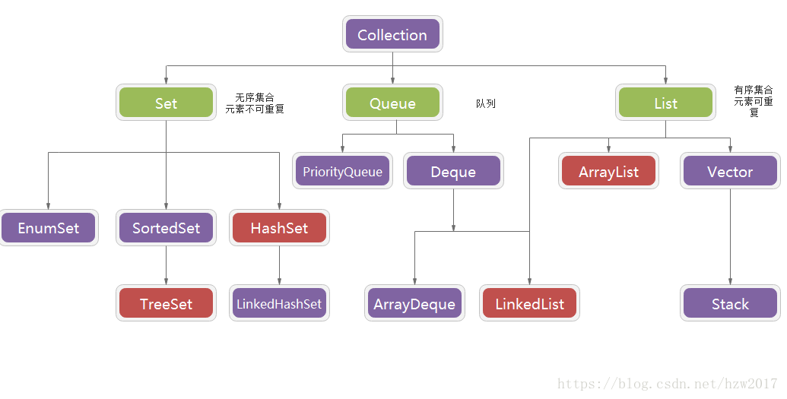
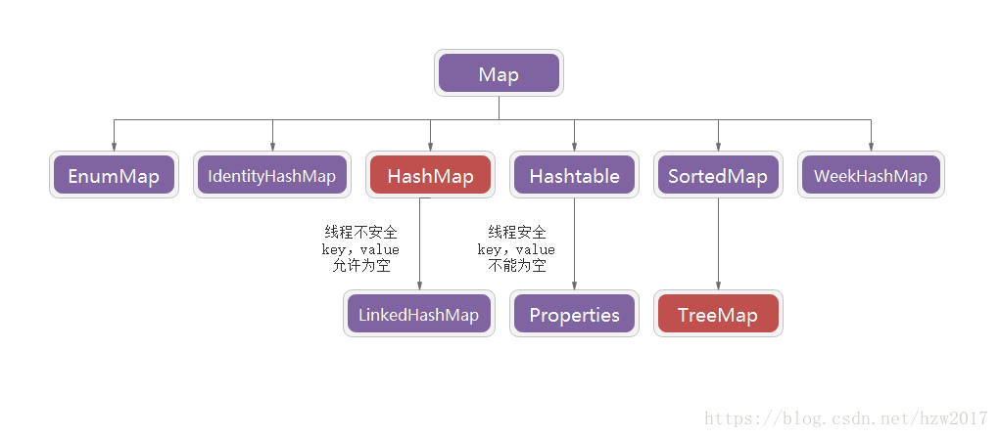

## Java集合框架

- 概念：在Java中类集框架实际上也就是对数据结构的Java实现。集合框架是为表示和操作集合而规定的一种统一的标准的体系结构。
任何集合框架都包含三大块内容：对外的接口、接口的实现和对集合运算的算法。

接口：即表示集合的抽象数据类型。接口提供了让我们对集合中所表示的内容进行单独操作的可能。

实现：也就是集合框架中接口的具体实现。实际它们就是那些可复用的数据结构。

算法：在一个实现了某个集合框架中的接口的对象身上完成某种有用的计算的方法，例如查找、排序等。
这些算法通常是多态的，因为相同的方法可以在同一个接口被多个类实现时有不同的表现。

Java集合主要有两个接口派生而出：Collection(List，Set，Queue)，Map，这个两个接口是Java集合框架的根接口。

其中HashSet、TreeSet、ArrayList、LinkedList是经常用到的实现类。

Map实现类是用于保存具有映射关系的数据。Map保存的每项数据都是键值对（key-value），Map中的key是不可重复的，key用于标识集合里的每项数据。
