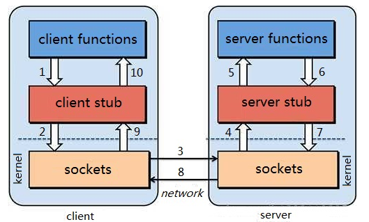

## RPC原理解析

1、概念

RPC(Remote Procedure Call Protocol)——远程过程调用协议，它是一种通过网络从远程计算机程序上请求服务，而不需要了解底层网络技术的协议。
RPC协议假定某些传输协议的存在，如TCP/IP或UDP，为通信程序之间携带信息数据。
RPC将原来的本地调用转变为调用远端的服务器上的方法，给系统的处理能力和吞吐量带来了近似于无限制提升的可能。
在OSI网络通信模型中，RPC跨域了传输层和应用层。RPC使得开发包括网络分布式多程序在内的应用程序更加容易

2、为什么要用RPC？ 

其实这是应用开发到一定的阶段的强烈需求驱动的

1）如果我们开发简单的单一应用，逻辑简单、用户不多、流量不大，那我们用不着；

2）当我们的系统访问量增大、业务增多时，我们会发现一台单机运行此系统已经无法承受。
此时，我们可以将业务拆分成几个互不关联的应用，分别部署在各自机器上，以划清逻辑并减小压力。
此时，我们也可以不需要RPC，因为应用之间是互不关联的。

3）当我们的业务越来越多、应用也越来越多时，自然的，我们会发现有些功能已经不能简单划分开来或者划分不出来。
此时，可以将公共业务逻辑抽离出来，将之组成独立的服务Service应用。
而原有的、新增的应用都可以与那些独立的Service应用 交互，以此来完成完整的业务功能。
所以此时，我们急需一种高效的应用程序之间的通讯手段来完成这种需求，所以使用RPC！

其实3描述的场景也是服务化 、微服务 和分布式系统架构 的基础场景。即RPC框架就是实现以上结构的有力方式

3、RPC架构

一个完整的RPC架构里面包含了四个核心的组件，分别是Client，Client Stub，Server以及Server Stub，这个Stub可以理解为存根。

客户端(Client)，服务的调用方。

客户端存根(Client Stub)，存放服务端的地址消息，再将客户端的请求参数打包成网络消息，然后通过网络远程发送给服务方。

服务端(Server)，真正的服务提供者。

服务端存根(Server Stub)，接收客户端发送过来的消息，将消息解包，并调用本地的方法

4、RPC调用过程

(1) 客户端（client）以本地调用方式（即以接口的方式）调用服务；

(2) 客户端存根（client stub）接收到调用后，负责将方法、参数等组装成能够进行网络传输的消息体（将消息体对象序列化为二进制）；

(3) 客户端通过sockets将消息发送到服务端；

(4) 服务端存根( server stub）收到消息后进行解码（将消息对象反序列化）；

(5) 服务端存根( server stub）根据解码结果调用本地的服务；

(6) 本地服务执行并将结果返回给服务端存根( server stub）；

(7) 服务端存根( server stub）将返回结果打包成消息（将结果消息对象序列化）；

(8) 服务端（server）通过sockets将消息发送到客户端；

(9) 客户端存根（client stub）接收到结果消息，并进行解码（将结果消息发序列化）；

(10) 客户端（client）得到最终结果。

RPC的目标是要把2、3、4、7、8、9这些步骤都封装起来。

- 注意：无论是何种类型的数据，最终都需要转换成二进制流在网络上进行传输，数据的发送方需要将对象转换为二进制流，而数据的接收方则需要把二进制流再恢复为对象。

